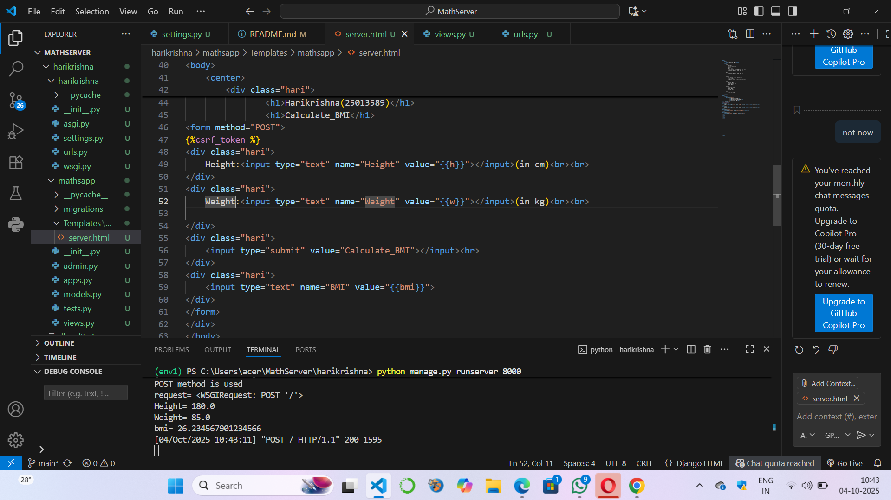
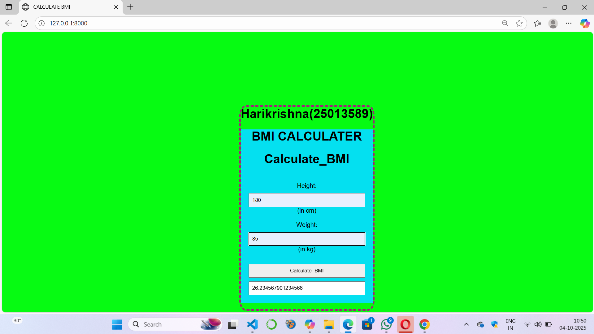

# Ex.05 Design a Website for Server Side Processing
## Date:04-10-2025

## AIM:
 To design a website to calculate thwe BMI Body Mass Index in the server side. 


## FORMULA:
BMI = W/H<sup>2</sup>
<br> BMI --> Body Mass Index
<br> H --> Height
<br> W --> Weight

## DESIGN STEPS:

### Step 1:
Clone the repository from GitHub.

### Step 2:
Create Django Admin project.

### Step 3:
Create a New App under the Django Admin project.

### Step 4:
Create python programs for views and urls to perform server side processing.

### Step 5:
Create a HTML file to implement form based input and output.

### Step 6:
Publish the website in the given URL.

## PROGRAM :
```
server.html

<html>
    <head>
        <title>CALCULATE BMI </title>
    <style>
        body{
            gap:40px;
            position: absolute;
            top:22%;
            right: 35%;
            border: dashed   4px rgb(160, 35, 119);
            border-radius: 5%;
            background: rgba(4, 224, 240, 1);
        }
        .hari{
            background: rgba(4, 224, 240, 1);

        }
         body {
            font-family: Arial, sans-serif;
            margin: 45px;
            background-color: rgba(6, 251, 18, 1);
        }
        form {

            padding: 20px;
            border-radius: 8px;
            width: 300px;
        }
        input {
            margin-top: 10px;
            width: 100%;
            padding: 8px;
        }
        h2 {
            margin-top: 20px;
        }
    </style>
</head>
<body>
    <h1>Harikrishna(25013589)</h1>
    <center>
        <div class="hari">
                <h1>BMI CALCULATER</h1>
                <h1>Calculate_BMI</h1> 
<form method="POST">

<div class="hari"> 
    Height:<input type="text" name="Height" value="{{h}}"></input>(in cm)<br><br> 
</div> 
<div class="hari"> 
    Weight:<input type="text" name="Weight" value="{{w}}"></input>(in kg)<br><br>

</div> 
<div class="hari"> 
    <input type="submit" value="Calculate_BMI"></input><br> 
</div> 
<div class="hari"> 
    <input type="text" name="BMI" value="{{bmi}}">
</div>
</form>
</div>
</body>
</html>


view.py

from django.shortcuts import render 
def calculate_bmi(request): 
    context={} 
    context['bmi'] = "" 
    context['h'] = "" 
    context['w'] = "" 
    if request.method == 'POST': 
        print("POST method is used")
        h = float(request.POST.get('Height',''))
        w = float(request.POST.get('Weight',''))
        print('request=',request) 
        print('Height=',h) 
        print('Weight=',w) 
        bmi = w / ((h / 100) ** 2)
        context['bmi'] = bmi 
        context['Weight'] = w
        context['Height'] = h 
        print('bmi=',bmi) 
    return render(request,'mathsapp/server.html',context)

url.py
from django.contrib import admin
from django.urls import path
from mathsapp import views

urlpatterns = [
    path('admin/', admin.site.urls),
    path('bmi/',views.calculate_bmi,
         name="BMI_calculator_root"),
    path('',views.calculate_bmi,name='home'),
]
```


## SERVER SIDE PROCESSING:


## HOMEPAGE:


## RESULT:
The program for performing server side processing is completed successfully.
